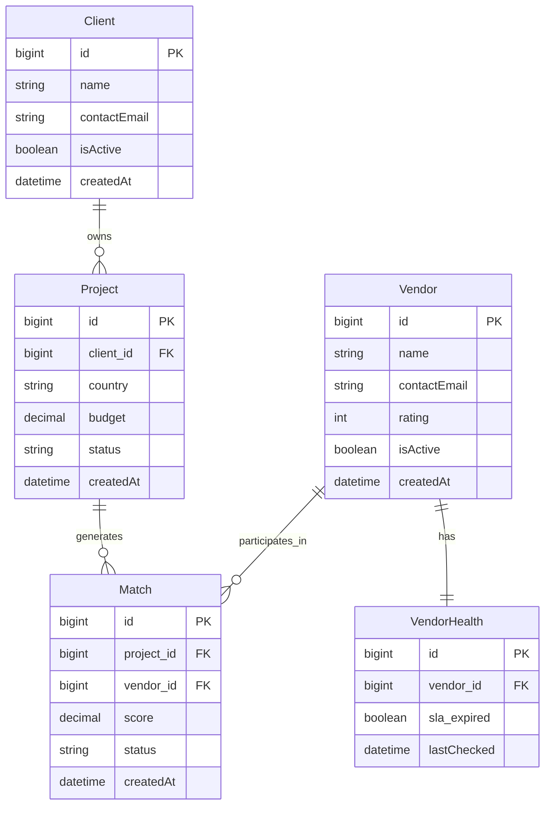

# Global Expansion Management API

A modular **NestJS** backend for managing vendors, clients, projects, and automated matching with SLA tracking.
Includes authentication, analytics, email notifications, scheduling, and Docker support.

---

## 🚀 Features

* 🔑 **Authentication & Authorization** (JWT-based with refresh tokens)
* 🏢 **Client & Vendor Management**
* 📂 **Project Management** with budget, country, and active status
* 🤝 **Matching Engine**:

    * Automated vendor matching for active projects
    * Weighted scoring system with configurable parameters
* ⏰ **Scheduling**:

    * Daily refresh of matches (`cron`)
    * SLA monitoring & vendor health flagging
* 📧 **Notifications**:

    * Email alerts for new matches
    * SLA expiry warnings
* 📊 **Analytics Dashboard**:

    * Cached reporting with configurable periods
* ⚡ **Throttling & Caching** built-in for scalability
* 🐳 **Docker-ready** for local or production deployment

---

## 📐 System Design Overview

### 📘 ERD Snapshot



---

## ⚙️ Clean Architecture

```text
src/
│
├── auth/ → JWT auth & guards
├── clients/ → Client entity, service, controller
├── vendors/ → Vendor entity, service, controller
├── projects/ → Project entity, service, controller
├── matches/ → Matching logic, scoring, rebuild jobs
├── notifications/ → Email service & notifications
├── scheduling/ → Cron jobs (match refresh, SLA check)
├── analytics/ → Cached reports & insights
├── common/ → Shared utils, interceptors, DTOs
└── app.module.ts → Root module wiring
```

---

## 🧰 Tech Stack

* Language: **TypeScript**
* Framework: **NestJS**
* ORM: **TypeORM**
* Databases:

    * **MySQL** (core entities: Clients, Projects, Vendors, Matches)
    * **MongoDB** (logging, analytics, cache extensions)
* Auth: **JWT** (access + refresh tokens)
* Scheduling: **NestJS Schedule (cron)**
* Notifications: **SMTP/MailHog** (mockable)
* Containerization: **Docker Compose**

---

## ⚒️ Setup Instructions

### 1. Clone the Repo

```bash
git clone https://github.com/YOUR_USERNAME/global-expansion-system.git
cd global-expansion-system
```

### 2. Environment Variables

Create two `.env` files depending on setup:

#### 📄 `.env.local`

```dotenv
PORT=3000
API_PREFIX=api/v1

MYSQL_HOST=localhost
MYSQL_PORT=3306
MYSQL_DATABASE=globexpand
MYSQL_USERNAME=root
MYSQL_PASSWORD=secret

MONGODB_URI=mongodb://localhost:27017/globexpand

JWT_SECRET=yourjwtsecret
JWT_EXPIRES_IN=1h
JWT_REFRESH_EXPIRES_IN=7d
```

#### 📄 `.env.docker`

```dotenv
PORT=3000
API_PREFIX=api/v1

MYSQL_HOST=mysql
MYSQL_PORT=3306
MYSQL_DATABASE=globexpand
MYSQL_USERNAME=root
MYSQL_PASSWORD=secret

MONGODB_URI=mongodb://mongo:27017/globexpand

JWT_SECRET=yourjwtsecret
JWT_EXPIRES_IN=1h
JWT_REFRESH_EXPIRES_IN=7d
```

---

### 3. Run with Docker Compose

```bash
docker compose up --build
```

This will start:

* MySQL (default: `3306`)
* MongoDB (default: `27017`)
* NestJS API (default: `http://localhost:3000/api/v1`)
* MailHog (SMTP testing on `http://localhost:8025`)

---

## 📊 API Documentation

API routes are auto-documented using **Swagger**.

> After running the project:
> [http://localhost:3000/api/v1/docs](http://localhost:3000/api/v1/docs)

---

## 🔔 Notifications & Scheduling

* **New Match Notification**: When a new match is generated, an email is sent to the client.
* **Daily Cron (0 3 \* \* \*)**:

    * Refresh matches for all active projects
    * Flag vendors with expired SLAs (`sla_expired = true`)

---

## 🧪 Sample Data

You can seed sample clients, vendors, and projects by running:

```bash
npm run seed
```

This will generate test data for matches and notifications.

---

## 📦 CI/CD with GitHub Actions

* ✅ Lint & Test on push
* ✅ Build Docker image
* ✅ Deploy staging/production pipelines

---

## 🧑‍💻 Contributing

We welcome contributions! Please open issues or submit PRs with improvements.

---

## 📄 License

This project is licensed under the MIT License.

---

## 🙏 Acknowledgements

1. [NestJS](https://nestjs.com/)
2. [TypeORM](https://typeorm.io/)
3. [MailHog](https://github.com/mailhog/MailHog)
4. [MySQL](https://www.mysql.com/)
5. [MongoDB](https://www.mongodb.com/)
6. [Docker](https://www.docker.com/)
